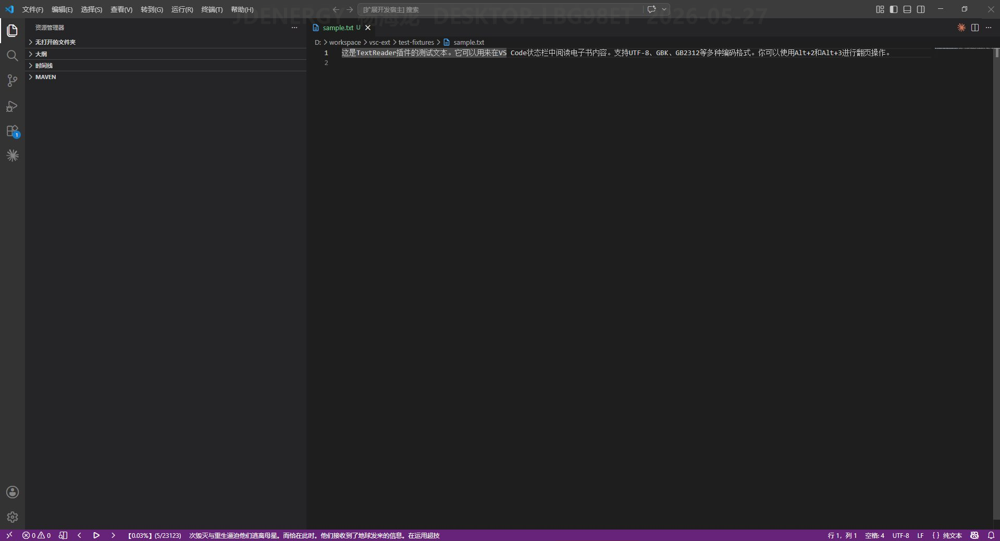

# TextReader - 状态栏阅读器

在 VS Code 状态栏中直接阅读电子书（.txt / .md），无需打开编辑器的全文标签页。

## 功能

- 在状态栏显示文本内容，每次一页
- 支持 **UTF-8 / GBK / GB2312** 编码
- 支持 **自动播放**（可配置间隔时间）
- 支持 **页码跳转** 和 **复制当前页内容**
- 快捷键控制：上一页 / 下一页 / 显示隐藏
- 页面进度百分比显示

## 快捷键

| 快捷键 | 功能 |
|--------|------|
| `Alt + 1` | 隐藏/显示状态栏 |
| `Alt + 2` | 下一页 |
| `Alt + 3` | 上一页 |

## 配置项

| 设置 | 默认值 | 说明 |
|------|--------|------|
| `txtReader.encoding` | `utf8` | 文件编码（utf8 / gbk / gb2312） |
| `txtReader.splitNumber` | `40` | 每页最大显示字数 |
| `txtReader.interval` | `3000` | 自动播放间隔（毫秒） |

## 使用

1. 点击状态栏的 `$(open-preview)` 图标，选择一个 `.txt` 或 `.md` 文件
2. 使用快捷键或点击状态栏按钮进行翻页
3. 点击播放按钮进入自动翻页模式

## 注意事项

- 打开文件后如显示乱码，请在设置中更换 `txtReader.encoding` 为对应的文件编码
- 状态栏文本区域点击可复制当前页内容到剪贴板
